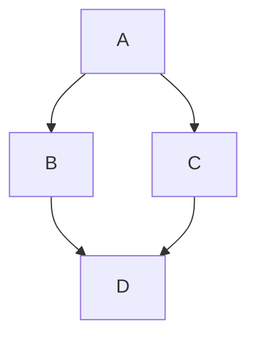

# Завдання 3. Граф знань для рекомендаційної системи

## 🔹 Частина 1 — проєктування схеми

(User {userId, gender, age, occupation})
(Movie {movieId, title, year})
(Genre {name})

(User)-[:RATED {rating, timestamp}]->(Movie)
(Movie)-[:HAS_GENRE]->(Genre)

### 1. Які сутності стали вузлами, а які — ребрами? Чому?

...

### 2. Оцінка користувача за фільм — це ребро `(User)-[:RATED]->(Movie)` чи окремий вузол `(Rating)`? Аргументуйте своє рішення. Це не риторичне запитання: в обох підходів є реальні trade-off-и.

...

### 3. Чому жанри фільму вигідніше зберігати як окремі вузли `(Genre)`, а не як список у властивості вузла `Movie`?

...

## 🔹 Частина 2 — Завантаження даних

[Output (02_output.md)](./outputs/02_output.md)

## 🔹 Частина 3 — Запити різної складності

[Output (03_output.md)](./outputs/03_output.md)

### 1. Що означає довжина шляху в даному контексті?

...

### 2. Один хоп — це один крок по ребру RATED, а значить — шлях довжини 2 означає, що два користувачі оцінили один і той самий фільм.

...

### 3. Як інтерпретувати шлях довжини 4? Довжини 6?

...

## 🔹 Частина 4 — Виявлення супервузлів

[Output (04_output.md)](./outputs/04_output.md)

### 1. Які вузли виявилися супервузлами? Скільки у них зв’язків?

...

### 2. Чому запит, що зачіпає такий вузол, працює повільніше, ніж запит по «звичайному» вузлу з тими самими індексами?

...

### 3. Яку конкретну стратегію з лекцій ви б застосували для цього датасету? (Підказка: подивіться на жанрові вузли — вони теж супервузли?) Що з ними робити?

...

## 🔹 Частина 5 — Графові алгоритми через GDS

[Output (05_output.md)](./outputs/05_output.md)

### 5.1. PageRank на графі фільмів

#### Що означає високий PageRank для фільму в цьому графі? Це просто “популярний фільм” чи щось інше?

...

### 5.2. Виявлення спільнот (Louvain)

#### 1. Чи відповідають отримані кластери інтуїтивним групам (наприклад, «любителі бойовиків», «цінителі арт-хаусу»)?

...

#### 2. Як ви це перевірили?

...

### 5.3. Найкоротший шлях між користувачами

#### 1. Наскільки «тісний світ» у цьому датасеті? Спробуйте кілька пар користувачів.

...

#### 2. Яка середня довжина шляху? Чи підтверджується гіпотеза «шести рукостискань»?

...

## 🔹 Частина 6 — Аналіз і висновки

### 1. Граф vs SQL. Які із запитів частини 3 було б складно або неможливо написати в SQL? Чому? Наведіть конкретний приклад — покажіть, як виглядав би еквівалентний SQL-запит (або поясніть, чому його не існує).

...

### 2. Де граф програє? Для яких задач із цим датасетом реляційна модель підійшла б краще? Наприклад: агрегація по всіх користувачах, звіти, експорт даних.

...

### 3. Покращення схеми. Які зміни в схемі прискорили б конкретні запити з частини 3? Розгляньте хоча б два запити.

...
