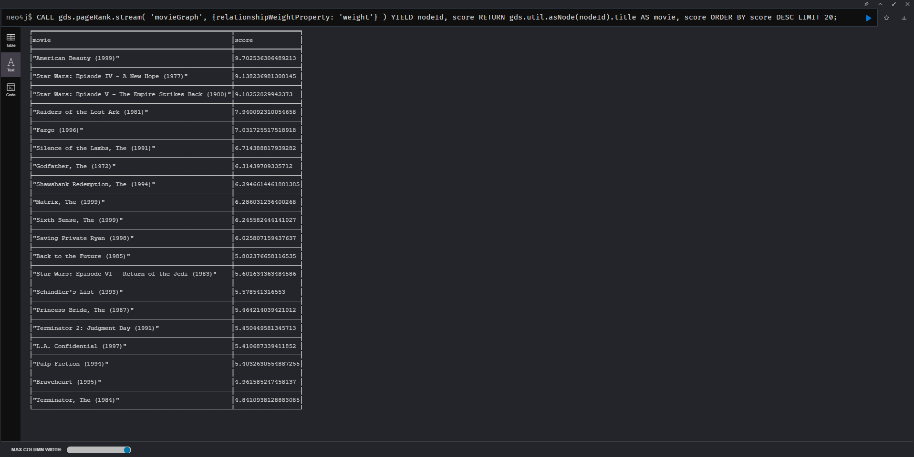
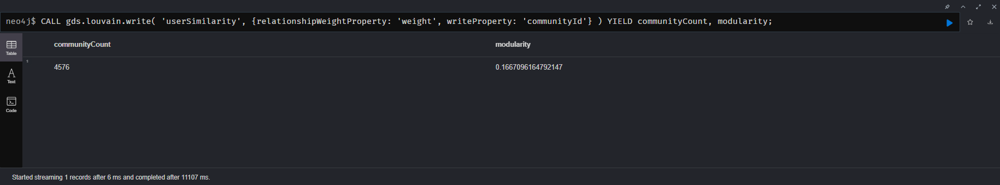
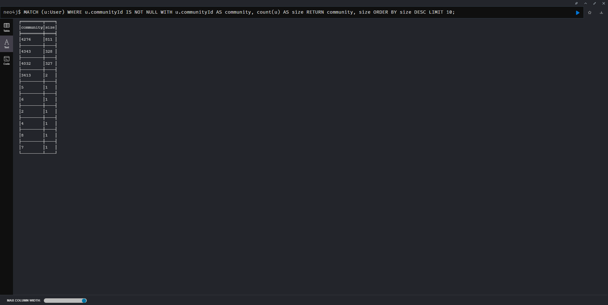
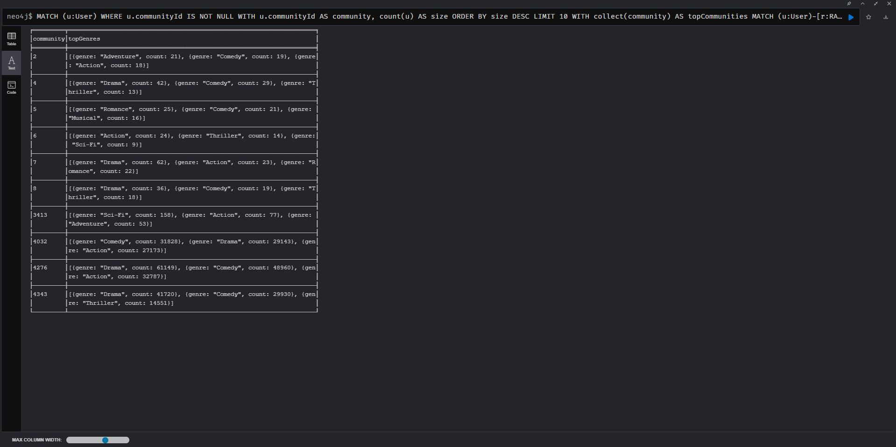
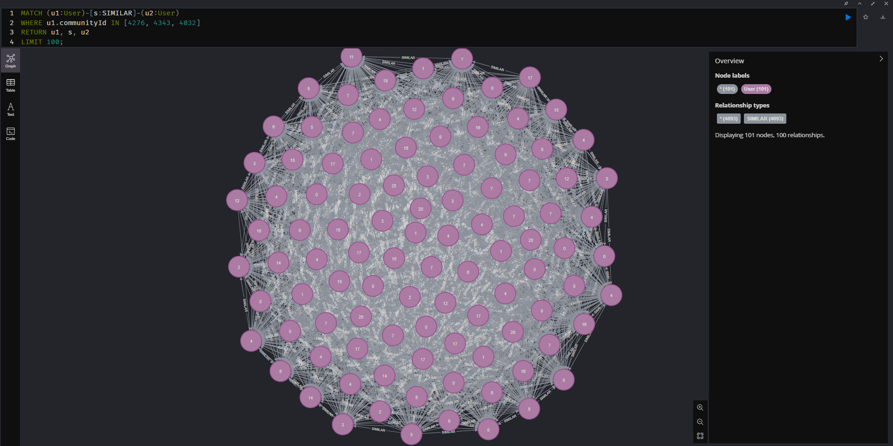
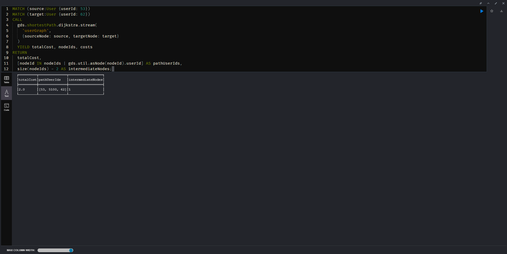

# Частина 5 - Скріншоти результатів

## 5.1. PageRank

## 5.2. Louvain

╒══════════════╤══════════════════╕
│communityCount│modularity        │
╞══════════════╪══════════════════╡
│4576          │0.1667096164792147│
└──────────────┴──────────────────┘

╒═════════╤════╕
│community│size│
╞═════════╪════╡
│4276     │811 │
├─────────┼────┤
│4343     │328 │
├─────────┼────┤
│4032     │327 │
├─────────┼────┤
│3413     │2   │
├─────────┼────┤
│5        │1   │
├─────────┼────┤
│6        │1   │
├─────────┼────┤
│2        │1   │
├─────────┼────┤
│4        │1   │
├─────────┼────┤
│8        │1   │
├─────────┼────┤
│7        │1   │
└─────────┴────┘

╒═════════╤══════════════════════════════════════════════════════════════════════╕
│community│topGenres                                                             │
╞═════════╪══════════════════════════════════════════════════════════════════════╡
│2        │[{genre: "Adventure", count: 21}, {genre: "Comedy", count: 19}, {genre│
│         │: "Action", count: 18}]                                               │
├─────────┼──────────────────────────────────────────────────────────────────────┤
│4        │[{genre: "Drama", count: 42}, {genre: "Comedy", count: 29}, {genre: "T│
│         │hriller", count: 13}]                                                 │
├─────────┼──────────────────────────────────────────────────────────────────────┤
│5        │[{genre: "Romance", count: 25}, {genre: "Comedy", count: 21}, {genre: │
│         │"Musical", count: 16}]                                                │
├─────────┼──────────────────────────────────────────────────────────────────────┤
│6        │[{genre: "Action", count: 24}, {genre: "Thriller", count: 14}, {genre:│
│         │ "Sci-Fi", count: 9}]                                                 │
├─────────┼──────────────────────────────────────────────────────────────────────┤
│7        │[{genre: "Drama", count: 62}, {genre: "Action", count: 23}, {genre: "R│
│         │omance", count: 22}]                                                  │
├─────────┼──────────────────────────────────────────────────────────────────────┤
│8        │[{genre: "Drama", count: 36}, {genre: "Comedy", count: 19}, {genre: "T│
│         │hriller", count: 18}]                                                 │
├─────────┼──────────────────────────────────────────────────────────────────────┤
│3413     │[{genre: "Sci-Fi", count: 158}, {genre: "Action", count: 77}, {genre: │
│         │"Adventure", count: 53}]                                              │
├─────────┼──────────────────────────────────────────────────────────────────────┤
│4032     │[{genre: "Comedy", count: 31828}, {genre: "Drama", count: 29143}, {gen│
│         │re: "Action", count: 27173}]                                          │
├─────────┼──────────────────────────────────────────────────────────────────────┤
│4276     │[{genre: "Drama", count: 61149}, {genre: "Comedy", count: 48960}, {gen│
│         │re: "Action", count: 32787}]                                          │
├─────────┼──────────────────────────────────────────────────────────────────────┤
│4343     │[{genre: "Drama", count: 41720}, {genre: "Comedy", count: 29930}, {gen│
│         │re: "Thriller", count: 14551}]                                        │
└─────────┴──────────────────────────────────────────────────────────────────────┘

## Візуалізація графа

## 5.3. Найкоротший шлях (Dijkstra)

